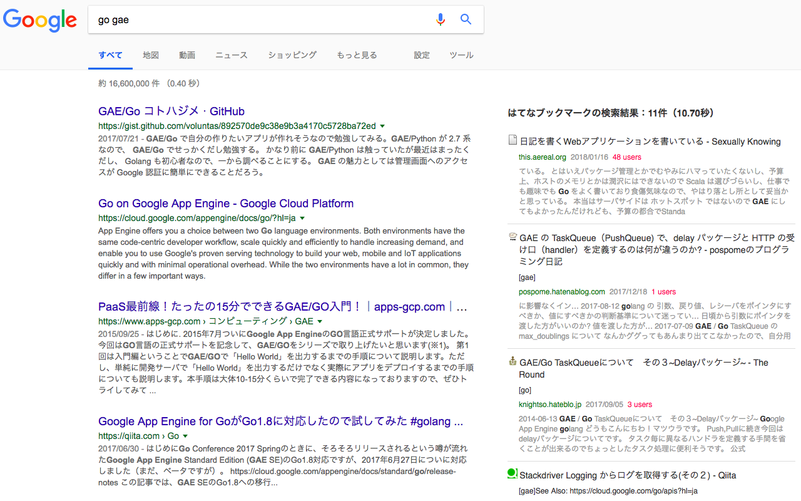

# はてなブックマーク全文検索 to Google

Google検索結果にはてなブックマーク全文検索結果も表示

## Screenshot



## Installation

https://chrome.google.com/webstore/detail/nbcahioceknecihmhhhglhlndlcolhdf

## Setup

```
npm install
```

## How to Release

1. manifest.json のバージョン名を更新して commit
2. `npm run release`
3. 生成された zip ファイルを Chrome Web Store にアップロード
